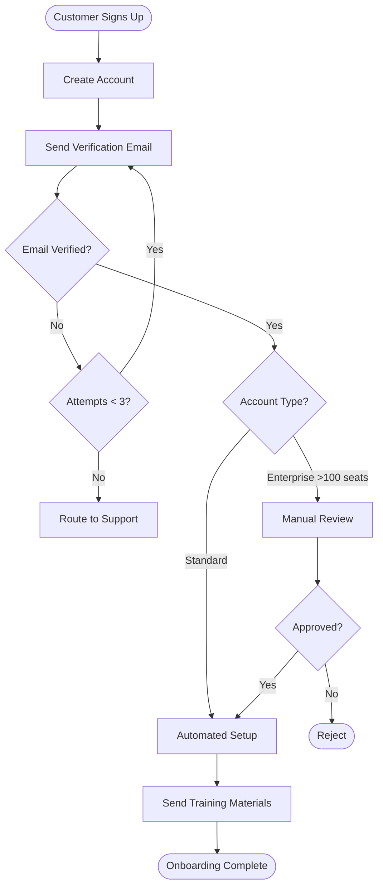

# Process Workflow Diagram Agent

An AI agent that transforms process knowledge from audio recordings, documentation, and voice notes into clear Mermaid workflow diagrams with speaker diarization support.

## Architecture

This project consists of two main components:

1. **WhisperX Service** - Standalone transcription & diarization service
2. **Open WebUI Function** - Integration layer for Open WebUI

### WhisperX Service

FastAPI service that handles audio transcription with speaker diarization using WhisperX.

**Features:**
- Multi-speaker audio transcription
- Speaker diarization (who said what)
- Support for multiple audio formats (mp3, wav, m4a, etc.)
- Configurable Whisper models
- REST API interface

### Open WebUI Function

A pipe function that connects Open WebUI to the WhisperX service, enabling seamless audio upload and transcription within the chat interface.

## Setup

### 1. WhisperX Service (Railway Deployment)

#### Prerequisites
- HuggingFace account and token
- Accept pyannote terms: https://huggingface.co/pyannote/speaker-diarization

#### Deploy to Railway

1. Create a new project on Railway
2. Add the `whisperx_service` directory
3. Set environment variables:
   ```
   WHISPER_MODEL=base
   DEVICE=cpu
   COMPUTE_TYPE=int8
   HF_TOKEN=your_huggingface_token
   ```
4. Railway will automatically detect the Dockerfile and deploy

#### Local Development

```bash
cd whisperx_service

# Install dependencies
uv sync

# Set up environment
cp .env.example .env
# Edit .env and add your HF_TOKEN

# Run the service
uv run uvicorn main:app --reload
```

The service will be available at `http://localhost:8000`

**API Endpoints:**
- `GET /health` - Health check
- `POST /transcribe` - Transcribe audio with diarization

### 2. Open WebUI Function

#### Installation

1. In Open WebUI, go to **Settings → Functions**
2. Click **+ Add Function**
3. Copy the contents of `openwebui_function/transcribe_audio.py`
4. Paste and save

#### Configuration

In the function settings (Valves), configure:
- `WHISPERX_SERVICE_URL` - Your Railway service URL (e.g., `https://your-app.railway.app`)
- `ENABLE_DIARIZATION` - Enable/disable speaker diarization (default: true)
- `MIN_SPEAKERS` - Minimum number of speakers (optional)
- `MAX_SPEAKERS` - Maximum number of speakers (optional)

### 3. System Prompt

1. In Open WebUI, go to **Settings → Models**
2. Create a new model preset or edit existing
3. Copy the contents of `resources/system_prompt.md`
4. Paste as the system prompt

## Usage

1. Start a chat in Open WebUI with your configured model
2. Upload an audio file (meeting recording, voice note, etc.)
3. The agent will:
   - Transcribe the audio with speaker labels
   - Ask clarifying questions about the process
   - Generate a Mermaid workflow diagram
   - Iterate based on your feedback

## Example Workflow

```
User: [Uploads meeting recording about customer onboarding]

Agent: I've transcribed the audio. I can see this involves:
- [SPEAKER_00]: Account creation and email verification
- [SPEAKER_01]: Manual review process for enterprise customers
- [SPEAKER_02]: Setup and training steps

Let me clarify a few things:
1. What happens if email verification fails after 3 attempts?
2. What triggers the manual review for enterprise customers?

User: Verification failures go to support. Manual review is triggered 
      for accounts with >100 seats.

Agent: Perfect! Here's the workflow diagram:



Does this accurately represent your process?
```

## Development

### Project Structure

```
.
├── whisperx_service/          # Transcription service
│   ├── main.py               # FastAPI application
│   ├── pyproject.toml        # Python dependencies (uv)
│   ├── Dockerfile            # Container configuration
│   └── .env.example          # Environment template
├── openwebui_function/        # Open WebUI integration
│   └── transcribe_audio.py   # Pipe function
├── resources/
│   └── system_prompt.md      # Agent system prompt
└── README.md
```

### Testing the WhisperX Service

```bash
# Health check
curl http://localhost:8000/health

# Transcribe audio
curl -X POST http://localhost:8000/transcribe \
  -F "audio=@meeting.mp3" \
  -F "enable_diarization=true"
```

## Notes

- WhisperX requires a HuggingFace token for diarization
- CPU inference is slower but works fine for most use cases
- For GPU acceleration on Railway, use a GPU-enabled plan and set `DEVICE=cuda`, `COMPUTE_TYPE=float16`
- Larger Whisper models (medium, large) are more accurate but slower

## License

MIT
